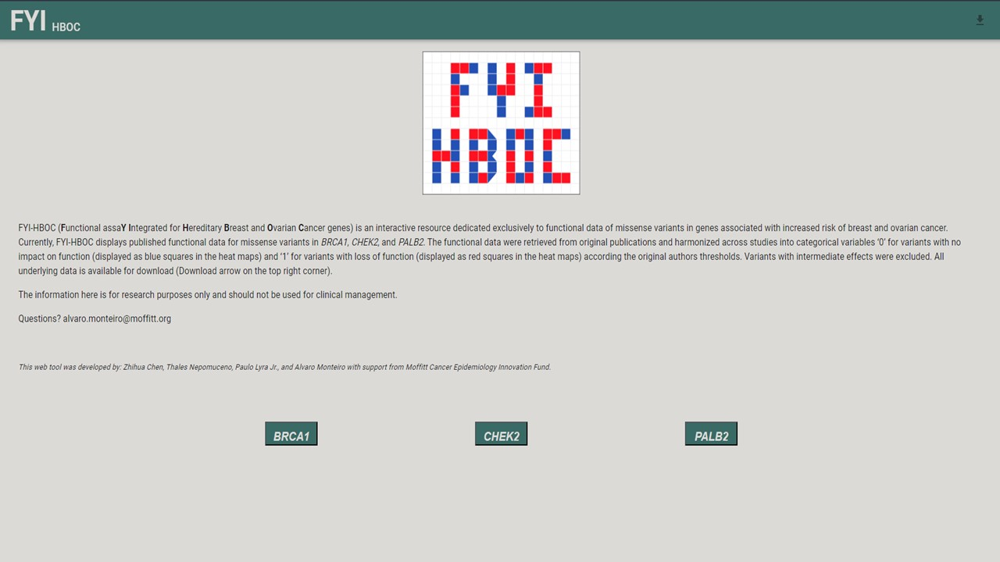

This code was generated as part of the article entitled: 
"Integration of functional assay data results provides strongevidence for 
classification of hundreds of BRCA1 variants ofuncertain significance".

All data sets used are available as supplementary materials associated with this article (Supplementary Tables 1–3). 
Thesedata sets and codes for queries to generate summary statistics and variant callings in Supplementary Tables 5–11. 

You could also check: http://iscva.moffitt.org/fyi-hboc/build/ to visualize the data

